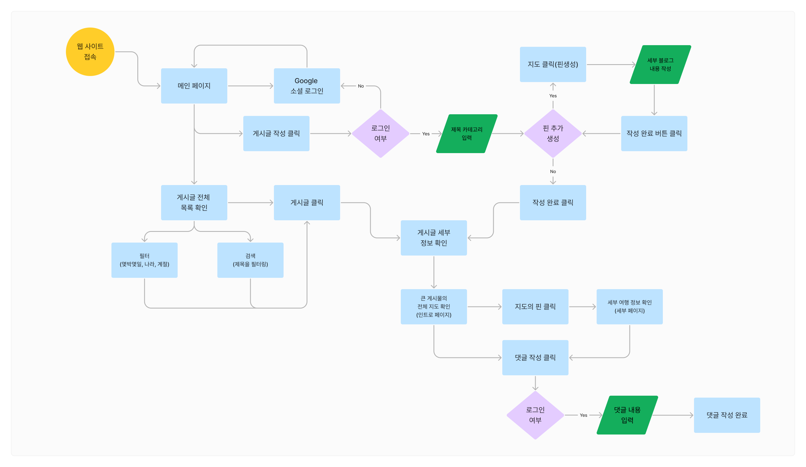

<h3>2023년도 2학기 모배디 1박 2일 해커톤 경진대회</h3>

<h3>💻 Tech Stack 💻</h3>

 

 

## 👨‍💻 Contributors 👩‍💻

<table>
  <tr>
    <td align="center">
      <a href="https://github.com/alstjr7437" target="_blank">
        
         
        <a href="https://github.com/UMC-PKNU-Hackathon/E-StrangePeople-Fronted/commits/main?author=alstjr7437" title="Code">alstjr7437 </a>
    </td>
    <td align="center">
      <a href="https://github.com/5622lsk" target="_blank">
        
         
        <a href="https://github.com/UMC-PKNU-Hackathon/E-StrangePeople-Fronted/commits/main?author=5622lsk" title="Code">5622lsk </a>
    </td>
    <td align="center">
      <a href="https://github.com/dani001024" target="_blank">
        
         
        <a href="https://github.com/UMC-PKNU-Hackathon/E-StrangePeople-Fronted/commits/main?author=dani001024" title="Code">dani001024 </a>
    </td>
    <td align="center">
      <a href="https://github.com/aong13" target="_blank">
        
         
        <a href="https://github.com/UMC-PKNU-Hackathon/E-StrangePeople-Fronted/commits/main?author=aong13" title="Code">aong13 </a>
    </td>
    <td align="center">
      <a href="https://github.com/Due_it" target="_blank">
        
         
        <a href="https://github.com/UMC-PKNU-Hackathon/E-StrangePeople-Backend/commits/main?author=Due_it" title="Code">Due_it </a>
    </td>
    <td align="center">
      <a href="https://github.com/JongKyeong" target="_blank">
        
         
        <a href="https://github.com/UMC-PKNU-Hackathon/E-StrangePeople-Backend/commits/main?author=JongKyeong" title="Code">JongKyeong </a>
    </td>
    <td align="center">
      <a href="https://github.com/Minseok-git" target="_blank">
        
         
        <a href="https://github.com/UMC-PKNU-Hackathon/E-StrangePeople-Backend/commits/main?author=Minseok-git" title="Code">Minseok-git </a>
    </td>
  </tr>
  <tr>
    <td align="center">김민석</td>
    <td align="center">임성경</td>
    <td align="center">김예진</td>
    <td align="center">오아영</td>
    <td align="center">양두영</td>
    <td align="center">김종경</td>
    <td align="center">최민석</td>
  </tr>
    <tr>
    <td align="center">PM</td>
    <td align="center">React</td>
    <td align="center">React</td>
    <td align="center">React</td>
    <td align="center">SpringBoot</td>
    <td align="center">SpringBoot</td>
    <td align="center">SpringBoot</td>
  </tr>
</table>

## 새록
#### 새록은 여행을 다니면서 이동했던 위치별로 기록을 하며 나중에 어떻게 여행을 다녔는지 확인 할 수 있는 여행 블로그 느낌의 React와 Spring Boot를 사용한 웹입니다.

---
### 주요 타겟

**여행을 다녀온 여행자의 경우**
1. 나의 즐거웠던 여행을 기록할 수 있어요 
2. 여행을 하면서 있었던 일들을 리마인드 할 수 있어요 
3. 다음에 해당 여행지를 갈때 도움이 되요 
4. 사진만 남는게 아닌 전체 여행의 분위기가 남아요 

**여행을 가려는 여행자의 경우** 
1. 여행을 어떤 흐름으로 놀았는지 확인이 가능해요  
2. 정확히 어떤 장소를 가게 되었는지 알 수 있어요  
3. 해당 여행지를 다녀온 사람의 이야기를 볼 수 있어요  

---
### Flow Chart
